## Barber Brain

Barber Brain is a comprehensive loyalty management system designed specifically for barbershops. It helps manage client data, track visits, and award loyalty points to enhance customer engagement and retention. The system allows barbershops to offer personalized rewards, such as free shaves, to their most loyal clients, thus improving customer satisfaction and encouraging repeat visits.

#### Click [here](https://barber-brain-7aba89f189d5.herokuapp.com/) to view the live site.
#### Please scroll to the bottom of this README file to view the login and client ID details on the Google Sheet screengrabs required to utilize this system.

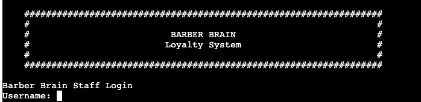

## Table of Contents
1. [Introduction](#introduction)
2. [User Stories](#user-stories)
3. [System Data Flow Chart](#system-data-flow-chart)
4. [Features](#features)
   - [Existing Features](#existing-features)
   - [Future Features](#future-features)
5. [Technologies Used](#technologies-used)
6. [Version Control](#version-control)
7. [Testing](#testing)
8. [Deployment](#deployment)
9. [Contact](#contact)
10. [Google Sheets Information](#google-sheets-information)
11. [Credits](#credits)

## Introduction

### The Client

The client operates a barbershop in a busy city center and seeks a loyalty system to enhance customer engagement and boost repeat business. The new system should efficiently manage the existing loyalty scheme, where clients earn a free shave after ten visits. It must be accessible to all staff, providing them with clients' loyalty and personal information to improve the customer experience.

### User Requirements

1. **As a Staff Member**, I wnat to easily access the system, type the client's name, and find their details with minimal clicks.
2. **As the Barber Shop Owner**, I want to View client visit frequency to understand repeat trade.
3. **As the Barber Shop Owner**, I wans to add login details for new staff members.
4. **SAs a staff member**, I want the system to provide clear client details as a prompt without relying on memory.

## System Data Flow Chart

The flow chart visually illustrates the sequence of steps and decisions a user experiences, along with the data paths involved. It maps out how users interact with the system and how data moves through different stages of the process.

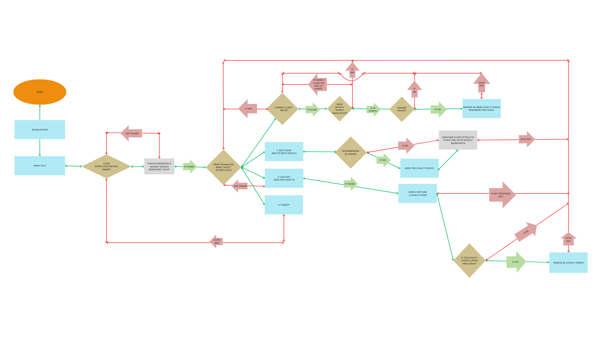
Created on [Canva](https://www.canva.com/)

## Features

### Existing Features

- **Client Management**: Store and manage client information.
- **Visit Tracking**: Track the number of visits each client makes.
- **Loyalty Points System**: Award and manage loyalty points.
- **Personalized Rewards**: Offer rewards like free shaves to loyal clients.
- **Title Banner**: A graphic banner at the top of the system frames the application, providing structure and visual appeal.
> 
- **Login Section**: A secure login page where staff members enter their username and password to access the system.
> 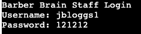
- **Navigation Menu**: Allows staff to navigate between searching for clients, adding new clients, logging visits, and logging out.
> 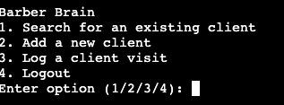
- **Search for a Client**: A search feature where staff can look up clients by first and last name to view loyalty details and personal information.
- **Add a New Client**: A form for adding new clients, allowing staff to enter details like name, contact info, and referral information.
- **Log a Client Visit**: Record a client's visit, update their visit count and loyalty points, and check if they qualify for a free shave.
- **Loyalty Points Management**: Manages client loyalty points, including a prompt to redeem points for a free shave if they have earned enough.
> 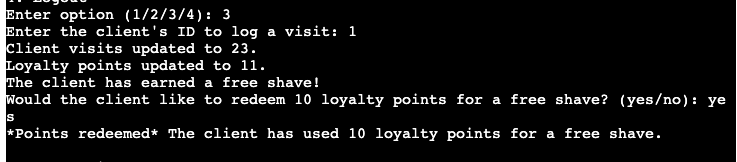
> 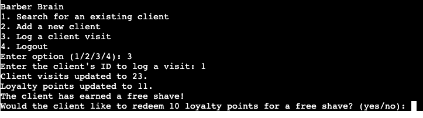
- **Error Handling and Validation**: Error messages and checks ensure all entered information, like emails and phone numbers, is correct.
> 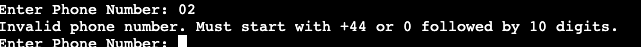
> 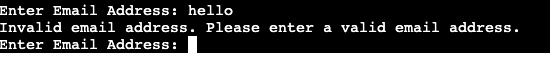
- **Logout Feature**: A straightforward button for staff to log out securely.

### Future Features

- Manager login feature to add new staff members.
- Ability for staff to change their own password.
- Option to hide passwords throughout the entire process.
- Customer login to view loyalty points.
- Automated email or text message notifications when clients reach 10 loyalty points.

## Technologies Used

- **Python**: The core programming language used.
- **Google Sheets API**: For managing and storing data on spreadsheets.
- **gspread**: Python library for interacting with Google Sheets.
- **Regular Expressions (re)**: For input validation.

- **GitHub**: Utilized to store the project files.
- **Heroku**: Utilized to deploy the site.

## Version Control

- **Git**: Utilized for version control, hosted on GitHub.
- **Git Commands**: Commands like `git add`, `git commit`, `git push`, and `git pull` were used regularly to manage the repository.

# Testing

### Bugs

#### Fixed

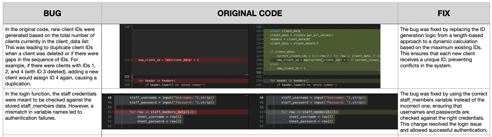
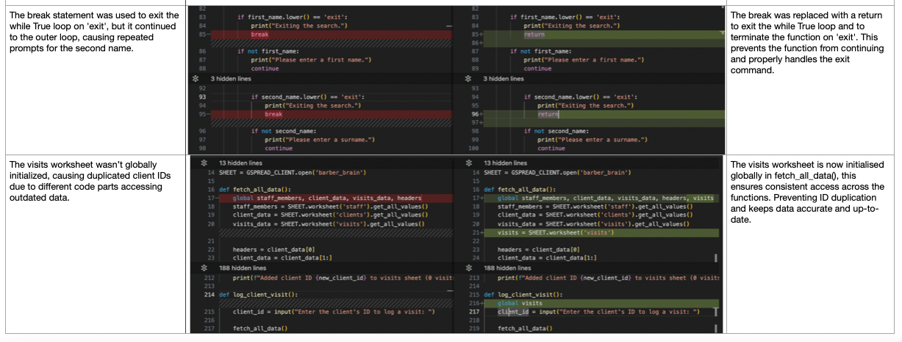

#### Existing 

### Manual Testing

> In-Line Command Code Testing - All manual in-line command code tests were executed successfully, with each test case returning a pass. This confirms that the system's core functionalities are operating as expected without errors.
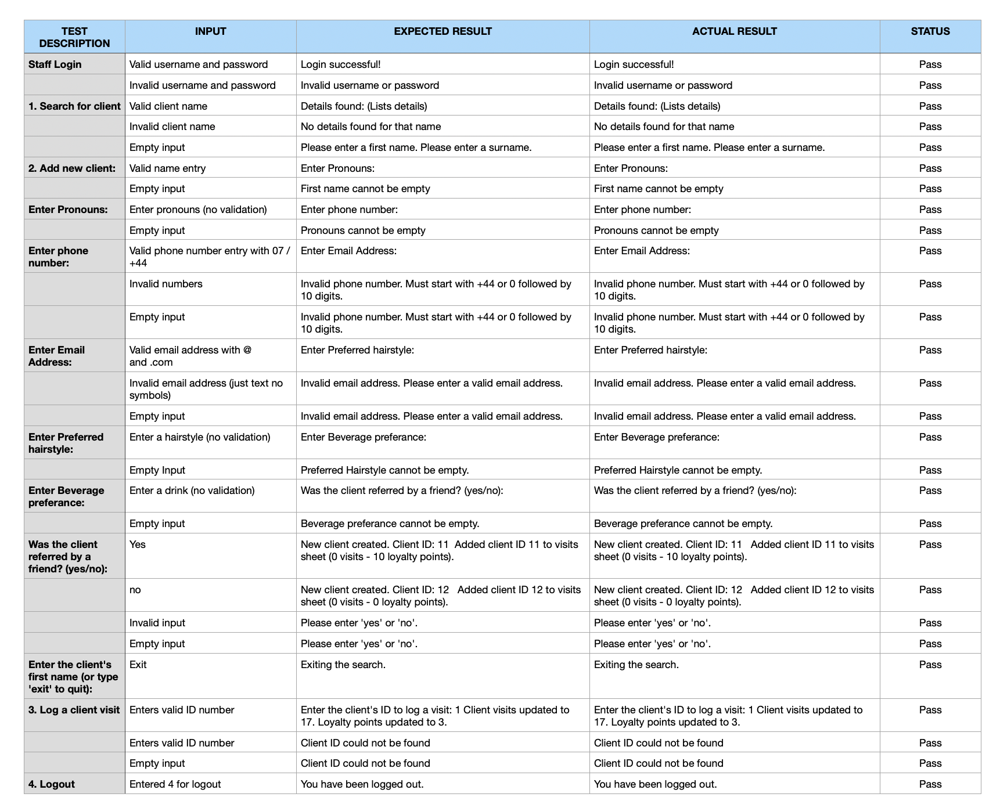

### Automatex Validator Testing

> [Linter Validation](https://pep8ci.herokuapp.com/#) - The linter validation ran successfully, with no errors returned. 
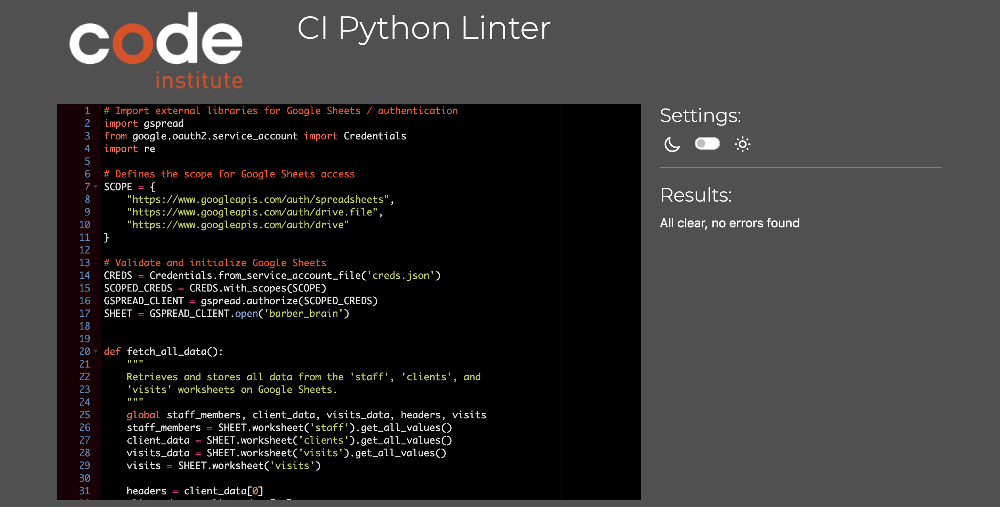

> The code was also checked against PEP8 with no errors returned.

## Deployment

### How the project was deployed:

The project was deployed using Heroku:

1. **Account Setup**: A Heroku account was created, and a new application was set up.
2. **Deployment Process**: The GitHub repository was connected to Heroku, and automatic deployment was enabled.
3. **Configuration**: Python and Node.js buildpacks were added to the configuration.
4. **Project Pushed to Heroku**: Changes were committed and pushed to the repository; Heroku detected the changes and automatically deployed the application.
5. **Post-Deployment Process**: The live application was tested within the Heroku CLI, and necessary adjustments were made and deployed.
6. **Summary**: Using Gitpod for development and Heroku for deployment streamlined the workflow from coding to deployment.

### How to clone the repository

1. Go to the [GitHub repository page](https://github.com/AlexBishopCode/Barber-Brain).
2. Click on the button labelled "Code", click and copy the HTTPS Link.
3. Open your termineal or command prompt.
4. Type 'git clone <https_link>', replacing <https_link> with the copied HTTPS link.
5. Navigate to the cloned directory by typing cd Barber-Brain.
5. Install the dependencies required for the project. This is achived by entering 'pip install -r requirements.txt'
6. Run the application

## Contact

For any questions or further information, please contact Alex at helloalexbishop@gmail.com

## Credits 

[Complete Python Mastery and Python Projects for Beginners - Code With Mosh](https://codewithmosh.com/)
> Utilsied heavily to build on the foundation knowledge set by the love-sandwiches tutorial and training content provided by CI.

[Using Python 🐍 with Google Sheets as a database](https://steemit.com/utopian-io/@drookyn/using-python-with-google-sheets-as-a-database)
> Utilised to help understand the main() and rows logic and inspired worksheet setup.

[RobustQA Abhishek Patel - AbhishRead and Write data from google sheets using Python](https://www.youtube.com/watch?v=hyUw-koO2DA)
>Utilised for understanding how to manipulate data between google sheets and github.

AI powered generator ['ChatGPT'](https://chatgpt.com/)
> Utilised after the Linter to reduce some character lenghts down when unclear how to do so.

[Python: apply lower() strip() and split() in one line](https://stackoverflow.com/questions/54884992/python-apply-lower-strip-and-split-in-one-line)
> Utilised to understand how to apply lower() and strip()

[Real Python - Using Python enumerate() With for Loops](https://www.youtube.com/watch?v=nI-jkrJxlz0)
[Phyton.ord - Built-in Functions](https://docs.python.org/3/library/functions.html#enumerate)
> Utilised to gain a better understanding of enumerate() 

## Google Sheets Information

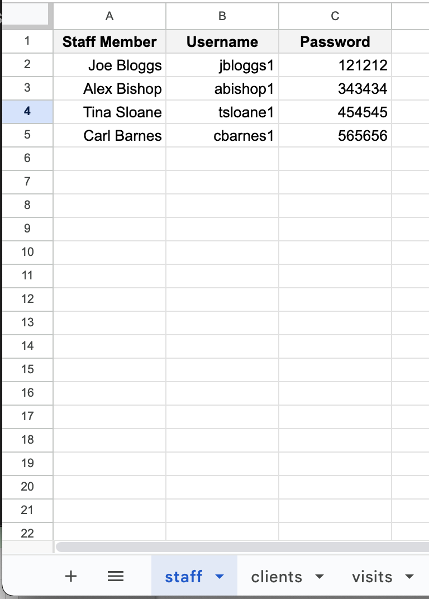
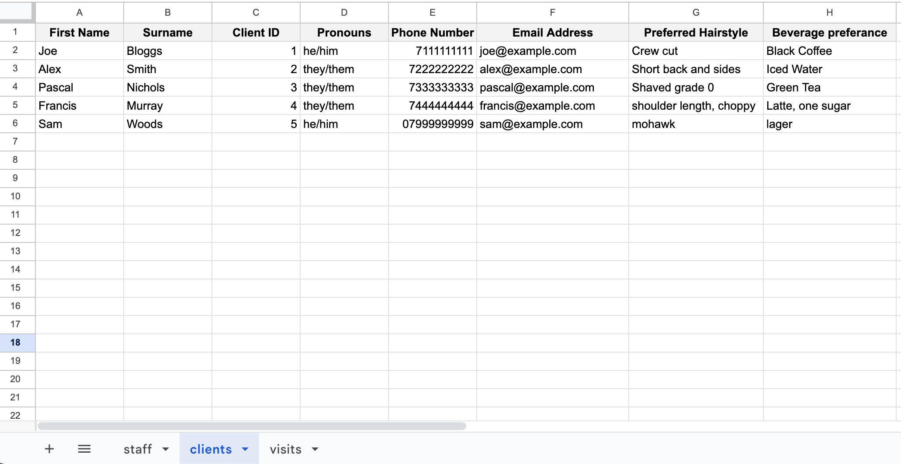
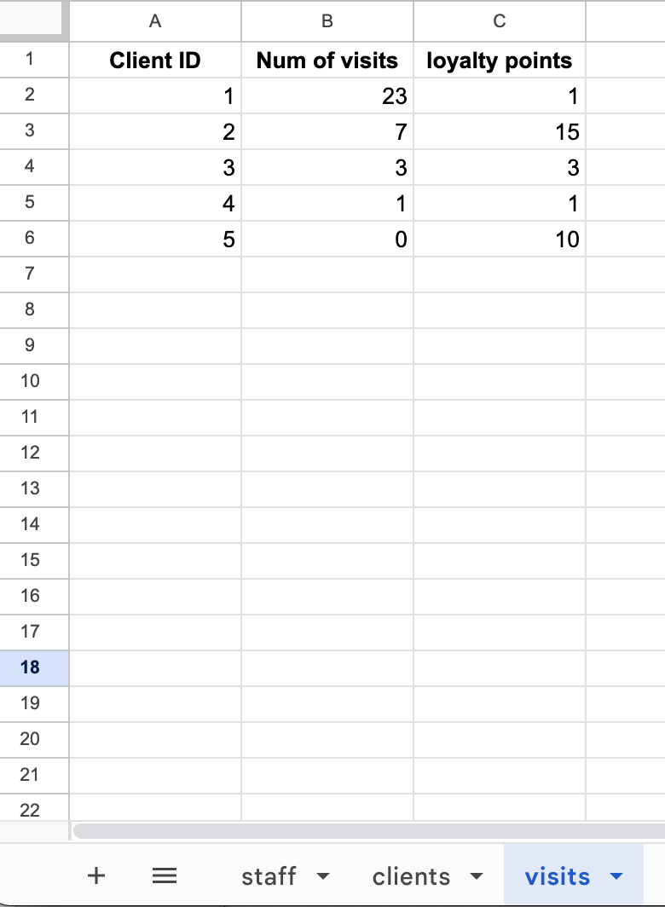